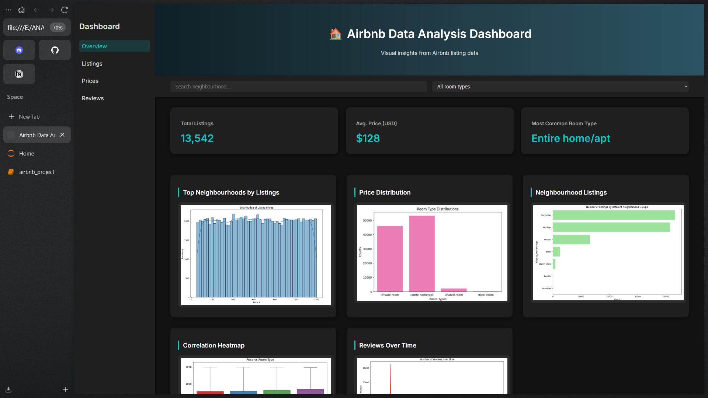

# 📊 Airbnb Data Analysis – Exploratory Data Insights

An in-depth data analysis project on Airbnb listings to uncover trends in pricing, location, availability, and other features. This project uses Python and Jupyter Notebook to deliver actionable insights through data cleaning, visualizations, and statistics.

---

## 📌 Features

- 🏙️ **Top Locations & Neighborhoods** by listing count and price
- 💸 **Price Trends** across room types and locations
- 🗓️ **Availability Patterns** throughout the year
- 📈 **Number of reviews** and Visual EDA
- 🧹 Cleaned & Preprocessed data for better accuracy

---

---

## 🧰 Tools & Skills Used

- Python 3.x
- Pandas, NumPy
- Matplotlib, Seaborn
- Data Cleaning & Feature Engineering
- Exploratory Data Analysis (EDA)
- Jupyter Notebook
- Data Visualization & Storytelling

---

## 📸 Screenshot

---

## 🔽 Download the Notebook

👉 [Click here to download the Airbnb analysis notebook](https://github.com/tapand3v3lop3r/Airbnb-Data-Analysis/blob/main/airbnb_project.ipynb)

---

## 🎥 Demo (Optional)

🎬 **Watch the walkthrough of this analysis:**  
🔗 [View Demo Video](link-to-your-demo-video)

---

## 💼 Use Case

This project helps:

- Understand pricing behavior and listing patterns
- Identify profitable locations and room types
- Inform hosts on optimizing listings
- Support customers in comparing options

---

## 🙌 Author

**Tapan Padhi**  
🔗 [LinkedIn](https://www.linkedin.com/in/tapanpadhi) | 🌐 [Portfolio](https://your-portfolio-link.com)

---

